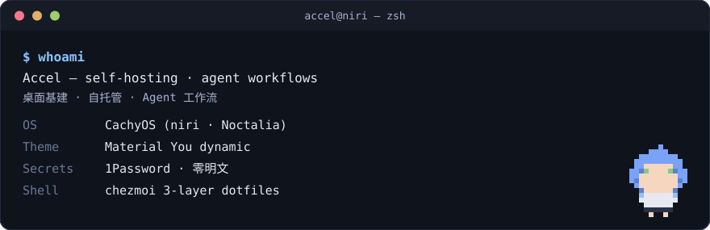

**Accel** — CachyOS / niri / Noctalia desktop · self-hosting · agent workflows

## About

- Linux 桌面基建:niri + Noctalia + `chezmoi` 三层 dotfiles 多机同步
- 自托管:Rust · systemd 用户服务 · Cloudflare Tunnel · 密钥零明文
- Agent 工作流:Claude Code 重度用户,自建 skill / 状态栏 / 用量链路
- Team 协作方向:agentic infrastructure · 企业级安全运维

## Principles

最小权限 · 密钥零明文 · 可审查可回滚 · 上游优先

<samp>♪ るんるんる〜ン ♪</samp>

